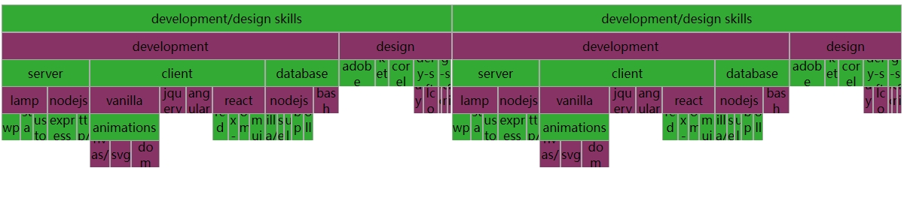

React FlameGraph
================

### React flamegraph visualization.

The main component is built by an inner recursive component which creates the visualization
mapping every item inside the corresponding `stack`.
leveraging the power of flexbox the implementation is trivial.

Signature for the props to pass to the component:

    type Stack = 
    {
      {
        name : string
        value: number,
        [ stack: ObjectWithValues( Stack ) ]
      }
    }

